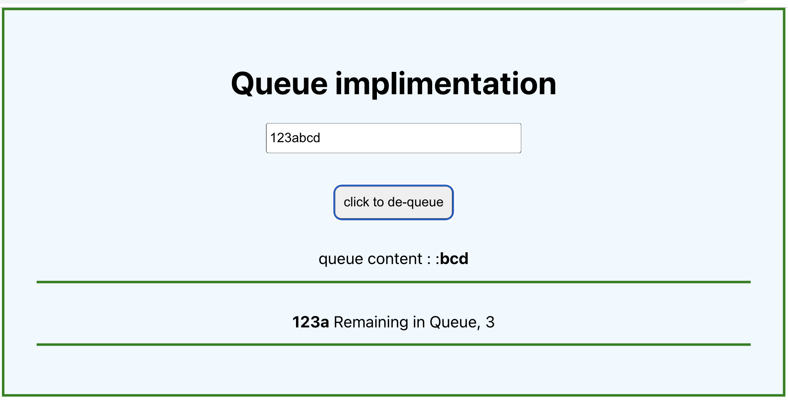

# Simple implimentation of queue
### whats a queue in computer data structure
A queue is a data structure that follows First In First Out (FIFO) or 'Last In, Last Out' principle. 

in this example a iser enter random string, and onlcickof the dequeue button the chars on the string are dequed one at a time

## technologies.

- React,
- JavaScript
- html,
- Css

## screenshot

